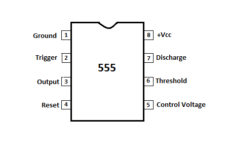
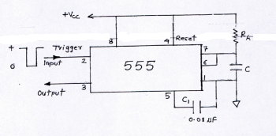
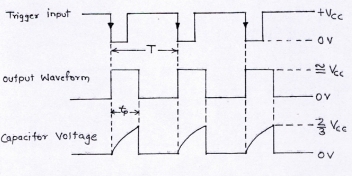

## Theory

One of the most versatile linear ICs is the 555 times. It was first introduced in early 1970 by Signetic Corporation giving the name as SE/NE 555 timer. The 555 is a monolithic timing circuit that can produce highly stable time delays or oscillation. The timer basically operates in one of the two modes either as monostable or as an astable multivibrator.

A monostable multivibrator, often called a one-shot multivibrator, is a Pulse generating circuit in which the duration of the pulse is determined by the RC network connected externally to the 555 timer. In a stable or standby state the output of the circuit is approximately zero or at logic-low level. When an external trigger pulse is applied, the output is forced to go high (≅ Vcc). The time the output remains high is determined by the external RC network connected to the timer. AT the end of the timing interval, the output automatically reverts back to its logic-low stable state. The output remains low until the trigger pulse is again applied. Then the cycle repeats. The monostable circuit has only one stable state (output low), hence the name monostable. Normally, the output of the monostable multivibrator is low

#### 555 pin configuration

The 555 IC is available as an 8-pin metal can as given below.

Figure 1

**Pin1 : Grounded Terminal** All the voltages are measured w.r.t. this terminal.  
**Pin2 : Trigger Terminal** This pin is an inverting input to a comparator that is reponsible for transition of flip-flop from set to reset. The output of the timer depends on the amplitude of the external tigger pulse applied to this pin.  
**Pin3 : Output Terminal** Output of the timer is available at this pin. There are two ways in which a load can be connected to the output terminal either between pin 3 and ground pin or between pin 3 and supply pin.  
**Pin4 : Reset Terminal**To disable or reset the timer a negative pulse is applied to this pin due to which it is referred to as reset terminal. When this pin is not to be used, it should be connected to +Vcc to avoid any possibility pf false triggering.  
**Pin5 : Control Voltage Terminal** The function of this terminal is to control the threshold and trigger levels. Thus either the external voltage or apot connected to this pin determines the pulse width of the output waveform. The external voltage applied to this pin can also be used to modulate th eoutput waveform. When this pin is not used, it should be connected to ground through a 0.01uF to avoid any noice problem.  
**Pin6 : Threshold Terminal** This is the noninverting input terminal of comparator 1,which compares the voltage applied to this terminal with a refernce volatge of +2/3 VCC. The amplitude of the volatge applied to this terminal is responsible for the set state of flip flop.  
**Pin7 : Discharge Terminal** This pin is connected internally to the collector of transistor and mostly a capacitor is discharge terminal because when transistor saturates, capacitor discharges through the transistor. When the transistor is cutoff, the capacitor charges at a rate determined by external resistor and capacitor.  
**Pin8 : Supply Terminal** A supply voltage of +5V to +18V is applied to this terminal w.r.t. to ground pin.

#### The 555 Timer as a Monostable Multivibrator

The schematic of a 555 timer in monostable mode of operation is shown in figure 2. The ciruit details are given below. Pin 1 is grounded. Trigger input is applied to pin 2. In quiescent condition of output this input is kept at +Vcc. To obtain transition of output from stable to quasistable state, a negative-going pulse of naroow width and amplitudeof greater than +2/3 Vcc
is applied to pin 2. Output is taken from pin 3. Pin 4 is usually connected to +Vcc
tp avoid reset. Pin 5 is grounded through a 0.01uF capacitor to avoid noise problem. Pin 6 is shorted to pin 7. A resistor RA
is connected between pins 6 and 8. At pin 7 a discharge capacitor is connected while pin 8 is connected to supply VCC.

Figure 2

#### Monostable operation:
According to Figure 1 initially when output is low, that is , the circuit is in a stable state, transistor Q1 is on and the capacitor C is shorted out of the ground. However, upon application of a negative trigger pulse to pin 2, transistor Q1 is turned off, which releases the short circuit across the external capacitor C and drives the output high. The capacitor C now starts charging up toward VCC through RA. However, when the voltage across the capacitor equals 2/3 VCC, comparator 1’s output switches from low to high, which in turn drives the output to its low state via the output of the flip-flop. At the same time, the output of the flip-flop turns transistor Q1 ON, and hence capacitor C rapidly discharges through the transistor. The output of the monostable remains low until a trigger pulse is again applied. Then the cycle reprats. Figure 3 shows the trigger input, output voltage, and capacitor voltage waveform. As shown here, the pulse width of the trigger input must be smaller than the expected pulse width of the output waveform. Also the trigger pulse must be a negative-going input signal with amplitude larger than 1/3 VCC.

Figure 3

#### Applications of monostable multivibrator
1. The monostable multivibrator is used as delay and timing circuits.
2. It is also used for temporary memories.
3. It is often used to trigger another pulse generator.
4. It is used for regenerating old and worn out pulses.